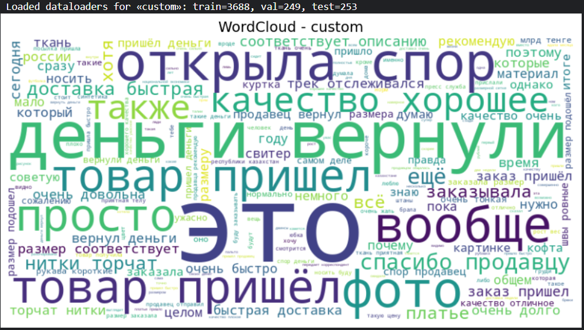
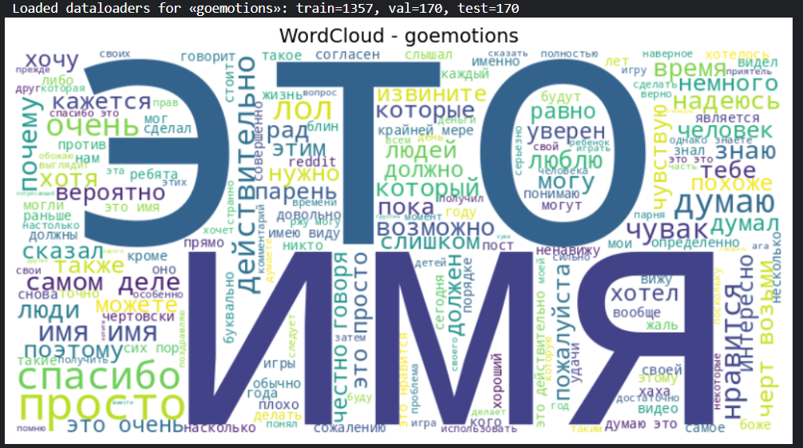

# Анализ эмоциональной тональности русскоязычных текстов  
**Тема:** анализ эмоциональной тональности русскоязычных текстов с использованием цифровых методов в рамках гуманитарных исследований  
 Целью работы является формирование эффективного инструментария, способного автоматически выявлять и классифицировать эмоционально окрашенные высказывания в различных типах текстов — от новостных публикаций до пользовательских отзывов, постов в социальных сетях и интернет-комментариев. Особое внимание уделяется интерпретации полученных результатов в контексте цифровых гуманитарных наук, что делает предложенный подход не только технически, но и методологически значимым. 
---

## 📦 Обзор проекта  

В этом репозитории реализован полный конвейер анализа эмоциональной тональности (sentiment & emotion) русскоязычных текстов:

1. **Подготовка данных** для трёх разных датасетов:  
   - **CEDR** (multi-label, 5 эмоций + `no_label`) — `cedr`  
   - **GoEmotions** (multi-label, 28 эмоций) — `goemotions`  
   - **Custom RU Sentiment** (single-label, 3 класса: `positive`, `neutral`, `negative`) — `custom`  

2. **Обучение моделей** на базе ruBERT (две архитектуры):  
   - `ruBert-base-cased`  
   - `ruBert-large`  

3. **Оценка качества**:  
   - Precision / Recall / F1  
   - AUC-ROC (micro / macro)  
   - Confusion matrix  
   - ROC-кривые  

4. **Визуализация**:  
   - WordCloud по каждому датасету  

5. **Ансамблевые методы**:  
   - Усреднение вероятностей (soft voting)  
   - Stacking (CatBoost, LogisticRegression, RandomForest, MLP)  
   - VotingClassifier (hard / soft)  

6. **Сохранение результатов**:  
   - CSV-отчёты с метриками (`reports/`)  
   - PNG-изображения (confusion matrices, ROC-кривые, WordClouds)  

---

## 🖼 WordCloud  

**CEDR**  

**Custom RU Sentiment**  

**GoEmotions**  

---

## 📊 Метрики и матрицы ошибок  

| Задача       | Модель              | CSV отчёт                                   | Confusion matrix PNG                             |
|--------------|---------------------|---------------------------------------------|--------------------------------------------------|
| **CEDR**       | ruBert-base-cased   | `reports/cedr_ruBert-base-cased_metrics.csv`   | `reports/cedr_ruBert-base-cased_confusion.png`      |
|              | ruBert-large        | `reports/cedr_ruBert-large_metrics.csv`        | `reports/cedr_ruBert-large_confusion.png`           |
| **GoEmotions** | ruBert-base-cased   | `reports/goemotions_ruBert-base-cased_metrics.csv` | `reports/goemotions_ruBert-base-cased_confusion.png` |
|              | ruBert-large        | `reports/goemotions_ruBert-large_metrics.csv`    | `reports/goemotions_ruBert-large_confusion.png`      |
| **Custom**    | ruBert-base-cased   | `reports/custom_ruBert-base-cased_metrics.csv`   | `reports/custom_ruBert-base-cased_confusion.png`      |
|              | ruBert-large        | `reports/custom_ruBert-large_metrics.csv`        | `reports/custom_ruBert-large_confusion.png`           |

---

## 📈 ROC-кривые  

*(Примеры сохранены в `images/roc/`)*

